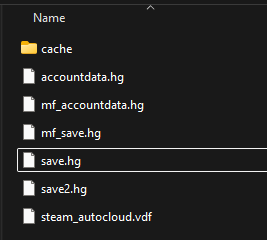
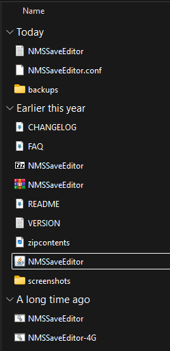
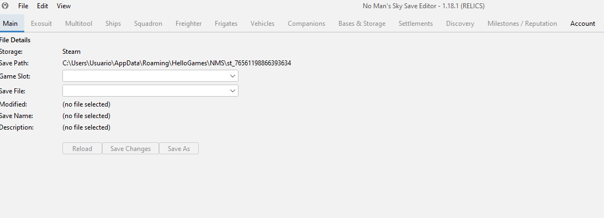
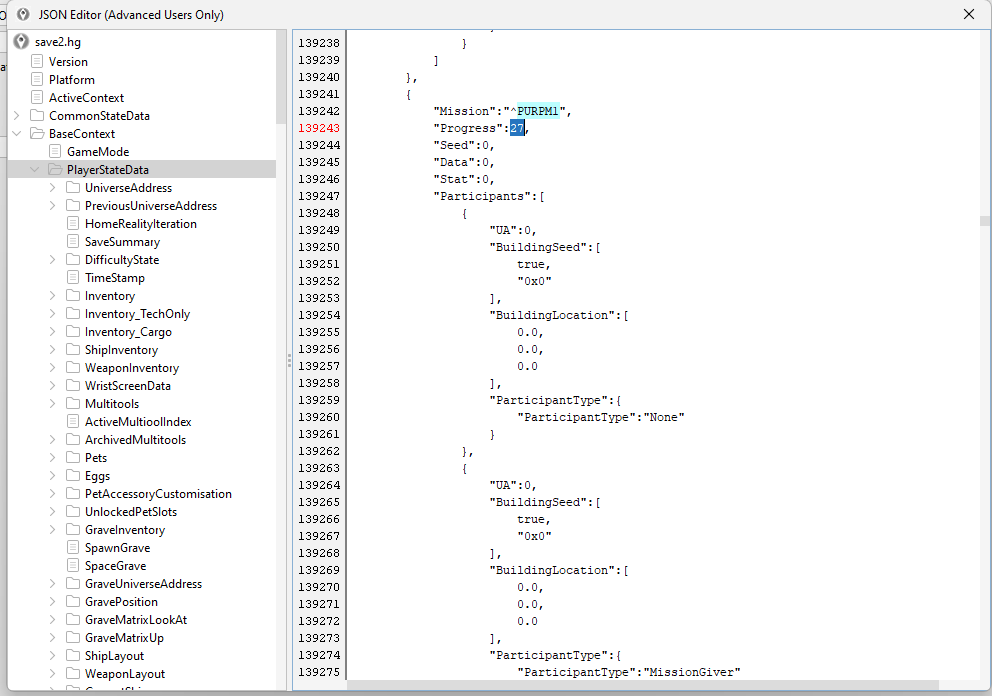

# Fix para Cualquier Misión Bugueada en No Man's Sky: "En multitudes estelares"

Bienvenido, viajero. Esta guía te ayudará a resolver cualquier misión atascada o bugueada en *No Man’s Sky*, como puede suceder al cambiar de galaxia, cargar saves antiguos o tras actualizaciones del juego.

👉 Usaremos como ejemplo práctico la misión **"En multitudes estelares" (Atlantid)**, la cual puede quedarse bloqueada sin razón aparente, impidiendo avanzar en la historia.

Este procedimiento te permitirá **completarla manualmente o reiniciarla** usando el editor de partidas **NMSSaveEditor**.

---

## 🧰 Qué necesitas

- PC con Windows (o sistema compatible con Java)
- Tener una partida de No Man's Sky
- [Descargar el editor NMSSaveEditor](https://github.com/goatfungus/NMSSaveEditor)

---

## ✅ PASOS COMPLETOS

### 1️⃣ Descargar el editor

1. Ve a: [https://github.com/goatfungus/NMSSaveEditor](https://github.com/goatfungus/NMSSaveEditor)
2. Haz clic en **"Releases"**
3. Descarga el `.zip` más reciente
4. Extrae el contenido y abre `NMSSaveEditor.jar`

> 💡 *Requiere tener Java instalado*

---

### 2️⃣ IMPORTANTE!!! Hacer copia de seguridad de tu partida SIEMPRE

Antes de tocar nada, guarda tus archivos de partida aquí:

``C:\Usuarios[TU_USUARIO]\AppData\Roaming\HelloGames\NMS\st_[ID_DE_STEAM]``


Haz copia de estos archivos:

- `save.hg`
- `save2.hg`
- `mf_save.hg`
- `mf_save2.hg`

__💾 ¿Que archivo .hg corresponde al tipo de guardado?__

En la carpeta:

save.hg → 🟢 Guardado manual (punto de restablecimiento)

save2.hg → 🔵 Guardado automático

mf_save.hg → Modo multijugador (manual)

mf_save2.hg → Modo multijugador (automático)



📁 Recomendado: copia y pégalos en el Escritorio.

---

### 3️⃣ Abrir el editor y cargar tu partida

1. Abre `NMSSaveEditor.jar`

2. Ve a `File > Open File/Path`
3. Selecciona `save.hg` o `save2.hg` (el más reciente) ``Probablemente el más reciente sea save2.hg``

4. Ve a `Edit > Edit Raw JSON`

---

### 4️⃣ Buscar la misión bugueada

BaseContext --> PlayerStateData 
Una vez en el editor JSON:

- Presiona `Ctrl + F`
- Escribe: `PURPM1`, `PURPM2`, `PURPM3` o `PURPM_BOAT`

Estas misiones son las distintas etapas de "En multitudes estelares". Yo recomiendo cambiar mejor `PURPM1`

📸 *Imagen búsqueda:*


---

### 5️⃣ Solucionar el bug

#### 🅰️ Opción A: Marcar misión como completada

Busca el bloque correspondiente a la misión bugueada (ej: `^PURPM1`, `^PURPM2`, etc.). Este bloque se verá más o menos así:

```json
{
  "Mission": "^PURPM1",
  "Progress": 27,
  "Seed": 0,
  "Data": 0,
  "Stat": 0,
  "Participants": [
    {
      "UA": 0,
      "BuildingSeed": [true, "0x0"],
      "BuildingLocation": [0.0, 0.0, 0.0],
      "ParticipantType": {
        "ParticipantType": "None"
      }
    },
    ...
  ]
}

🔧 Modifica solo el valor de Progress:

json
Copy code
"Progress": 255
```

Esto forzará al juego a considerar la misión como completada.

🅱️ Opción B: Eliminar la misión por completo
Si prefieres que el juego reinicie la misión de forma limpia:

Selecciona y elimina todo el bloque correspondiente a la misión ({...} completo).

Asegúrate de no dejar comas colgantes si es el último bloque en la lista.

Revisa que el archivo JSON siga siendo válido.

💡 Tip si aún no se actualiza
Si el juego no actualiza inmediatamente el estado de la misión tras editar el archivo, puedes intentar lo siguiente:

✅ Quédate dentro de la Anomalía Espacial unos segundos tras cargar la partida.

🚀 Si no ves cambios, viaja a otro sistema estelar usando el mapa galáctico.

🔌 Como último recurso, desactiva el modo multijugador temporalmente o desconecta el internet al iniciar el juego (esto forzará una carga más "limpia").

⚠️ Asegúrate siempre de guardar los cambios en el editor (Ctrl + S) antes de cerrar.


### Espero que te haya servido de ayuda buen viaje viajero.